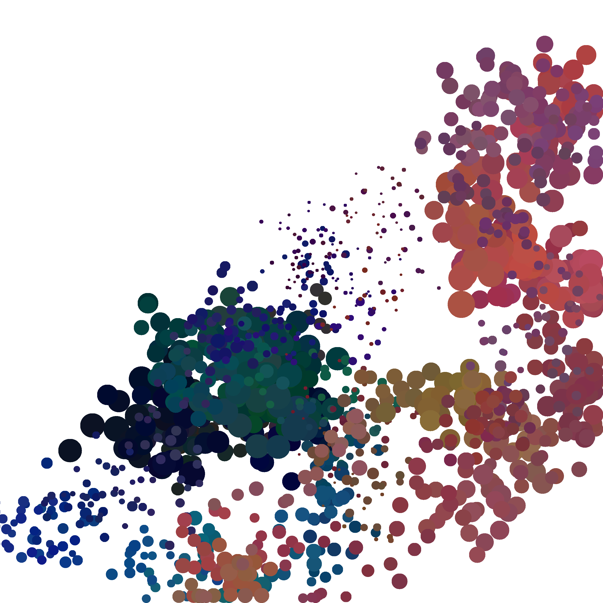

My very first python code (from 2013)...

... creating images:

... and movies:

Thanks to the [GTPB](https://github.com/GTPB), and teachers [Allegra Via](https://github.com/allegravia) and [Kristian Rother](https://github.com/krother).
